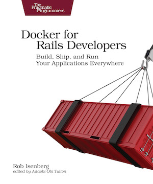

[](https://gitpitch.com/enogrob/ebook-project/master)
```
Roberto Nogueira  
BSd EE, MSd CE
Solution Integrator Experienced - Certified by Ericsson
```
# eBook Docker for Rails Developers



**About**

Learn everything you need to about the subject of this `eBook` project.

[Homepage](https://pragprog.com/book/ridocker/docker-for-rails-developers)

## Topics
```
Introduction
Development
1. A Brave New World
[x] Installing Docker
[x] Verifying Your Install
[x] Before We Begin
[x] Running a Ruby Script without Ruby Installed
[x] Generating a New Rails App without Ruby Installed
[x] Quick Recap
2. Running a Rails App in a Container
[x] How Do We Run Our Rails App?
[x] Defining Our First Custom Image excerpt
[x] Building Our Image
[x] Running a Rails Server with Our Image
[x] Reaching the App: Publishing Ports
[x] Binding the Rails Server to IP Addresses
[x] Quick Recap
3. Fine-Tuning Our Rails Image
[x] Naming and Versioning Our Image
[x] A Default Command
[x] Ignoring Unnecessary Files
[x] The Image Build Cache
[x] Solving a Caching Problem
[x] The Finishing Touch
[x] Quick Recap
4. Describing Our App Declaratively with Docker Compose
[x] Getting Started with Compose
[x] Launching Our App
[x] Mounting a Local Volume
[x] Starting and Stopping Services excerpt
[x] Other Common Tasks
[x] Quick Recap
5. Beyond the App: Adding Redis
[x] Starting a Redis Server
[x] Manually Connecting to the Redis Server
[x] How Containers Can Talk to Each Other excerpt
[x] Our Rails App Talking to Redis
[x] Starting the Entire App with Docker Compose
[x] Quick Recap
6. Adding a Database: Postgres
[x] Starting a Postgres Server
[x] Connecting to Postgres from a Separate Container
[x] Connecting Our Rails App to Postgres
[x] Using the Database in Practice
[x] Decoupling Data from the Container
[x] Quick Recap
7. Playing Nice with JavaScript
[x] The JavaScript Front-End Options
[x] Rails JavaScript Front-End with Webpacker
[ ] Compiling Assets with Webpacker
[ ] Hello World React App
[ ] Quick Recap
8. Testing in a Dockerized Environment
[ ] Setting Up RSpec
[ ] Our First Test
[ ] Setting Up Rails System Tests
[ ] Running Tests That Rely on JavaScript
[ ] Debugging
[ ] Quick Recap
9. Advanced Gem Management
[x] The Downside to Our Existing Approach
[x] Using a Gem Cache Volume
[x] Quick Recap
10. Some Minor Irritations
[x] Rails tmp/pids/server.pid Not Cleaned Up
[x] Compose Intermittently Aborts with Ctrl-C
[x] Quick Recap
[x] Closing Thoughts on Docker in Development
11. The Production Landscape
[ ] The "Ops" in DevOps
[ ] Container Orchestration
[ ] A Tale of Two Orchestrators: Swarm and Kubernetes
[ ] IaaS vs CaaS
[ ] Provisioning Your Infrastructure
[ ] CaaS Platforms
[ ] Serveless for Containers
[ ] How to Decide What's Right for Me?
[ ] Quick Recap
12. Preparing for Production
[ ] Configuring a Production Environment
[ ] A Production Image: Precompiling Assets
[ ] Sharing Images
[ ] Quick Recap
13. A Production-Like Playground
[ ] Creating Machines
[ ] Introducing Docker Swarm
[ ] Our First (Single Node) Swarm
[ ] Describing Our App to Swarm
[ ] Migrating the Database
[ ] Deploying Our App on a Swarm
[ ] Tasks and Swarm’s Scaling Model
[ ] Scaling Up the Service
[ ] Quick Recap
```
